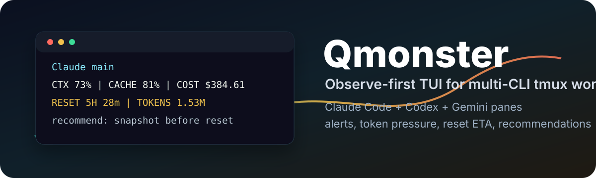
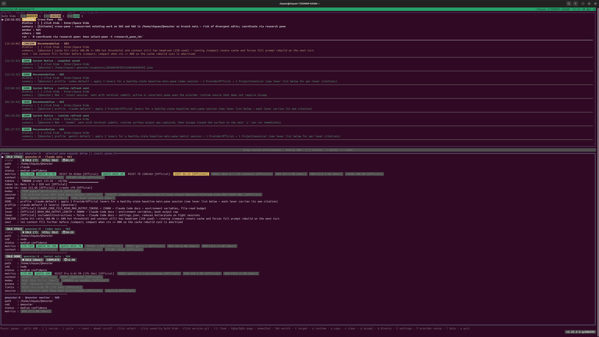
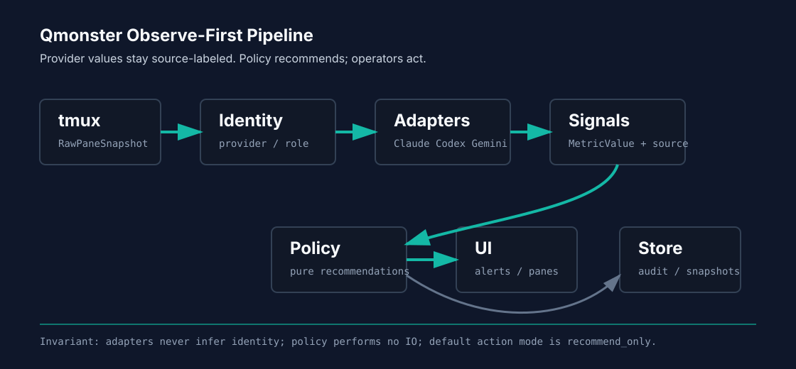

<p align="center">
  
</p>

<h1 align="center">Qmonster</h1>

<p align="center">
  <strong>Observe-first Rust TUI for multi-CLI tmux development.</strong>
</p>

<p align="center">
  <a href="https://github.com/chquandogong/qmonster/actions/workflows/ci.yml"></a>
  <a href="https://github.com/chquandogong/qmonster/releases"></a>
  <a href="https://www.npmjs.com/package/qmonster"></a>
  <a href="https://github.com/chquandogong/qmonster/pkgs/npm/qmonster"></a>
  <a href="LICENSE"></a>
  
  
</p>

<p align="center">
  <a href="#quick-start">Quick Start</a>
  · <a href="#what-it-shows">What It Shows</a>
  · <a href="#data-contracts">Data Contracts</a>
  · <a href="https://github.com/chquandogong/qmonster/releases">Releases</a>
  · <a href="https://github.com/chquandogong/qmonster/discussions">Discussions</a>
  · <a href="docs/ai/UI_MANUAL.md">UI Manual</a>
</p>

Qmonster watches a tmux workspace that runs Claude Code, Codex, Gemini,
and Qmonster side by side. It surfaces pane state, token pressure,
provider facts, reset timing, safety alerts, and recommendations without
taking destructive action by default.

| Surface             | Current                                                |
| ------------------- | ------------------------------------------------------ |
| Release             | `v1.41.0`                                              |
| npm                 | `qmonster@1.41.0`                                      |
| Rust                | `1.88+`                                                |
| Runtime version     | `git describe --tags --always --dirty` from `build.rs` |
| Cargo crate version | Internal metadata only                                 |

## Why

Multi-agent tmux work is powerful, but easy to lose track of. Qmonster
answers the operational questions that usually require constant manual
checking:

- Which pane is waiting, blocked, stale, or still working?
- Which session is approaching context or quota pressure?
- Which provider facts are official, estimated, or heuristic?
- Which reset window is close enough to wait or snapshot first?
- Which recommendation is worth acting on now?

The design contract is intentionally conservative:

1. Observe first.
2. Alert first.
3. Recommend first.
4. No destructive automation by default.

See [PROJECT_BRIEF.md](docs/ai/PROJECT_BRIEF.md) for the full project
intent.

## Quick Start

```bash
# Install from npmjs. The package runs the Rust binary from source, so a
# working Rust toolchain is still required.
npm install -g qmonster
qmonster --help

# Or build directly from source.
cargo build --release
cargo run --release
```

For normal local operation:

```bash
# Creates ~/.qmonster/config/qmonster.toml and pricing.toml from templates
# when missing, then starts the TUI with a persisted config path.
./scripts/run-qmonster.sh
```

Smoke checks:

```bash
cargo run -- --once
./scripts/check-tmux-source-parity.sh --all-targets --repeat 3
./scripts/run-qmonster-control-mode-once.sh --root /tmp/qmonster-smoke
```

GitHub Packages mirrors the npm source package:

```bash
npm config set @chquandogong:registry https://npm.pkg.github.com
npm install -g @chquandogong/qmonster
```

## What It Shows

<p align="center">
  
</p>

| Area            | Operator-visible result                                              |
| --------------- | -------------------------------------------------------------------- |
| Pane state      | Work complete, active, stale, input wait, permission wait, limit hit |
| Metrics         | CTX, quota, tokens, cache, memory, cost, reset ETA                   |
| Runtime facts   | Session IDs, transcript paths, tool calls, model reset rows          |
| Recommendations | Alert/advisory queue with source-labeled reasons and commands        |
| Settings        | Thresholds, integrations, parameters, rules, badge glossary          |
| Git status      | Click the footer version badge to inspect local repo state           |

Sanitized provider tails for demos and screenshots live in
[examples/demo](examples/demo/).

Primary keys:

| Key         | Action                                                     |
| ----------- | ---------------------------------------------------------- |
| `q` / `Esc` | Quit or close overlay                                      |
| `Tab`       | Switch alert/pane focus                                    |
| `t`         | Choose tmux session/window target                          |
| `s`         | Write runtime snapshot                                     |
| `u`         | Refresh provider runtime surfaces                          |
| `P`         | Provider Setup overlay                                     |
| `S`         | Settings overlay                                           |
| `?`         | Help / legend                                              |
| Mouse       | Scroll, select, double-click alert hide, footer Git status |

For a matching four-pane tmux layout, open Provider Setup with `P`,
select the `Tmux` tab, and copy the installer. It writes:

- `~/ts.sh`
- `~/.tmux/qmonster.tmux.conf`

## Data Contracts

Qmonster labels every provider-derived value by authority:

| Label        | Meaning                                                           |
| ------------ | ----------------------------------------------------------------- |
| `[Official]` | Emitted by the provider or a provider-owned config/status surface |
| `[Project]`  | Qmonster policy or project-canonical rule                         |
| `[Heur]`     | Local heuristic, such as process RSS or memory-file scan          |
| `[Estimate]` | Derived from local pricing or non-provider calculation            |

Metric contract:

| Metric   | Claude                             | Codex                       | Gemini                     |
| -------- | ---------------------------------- | --------------------------- | -------------------------- |
| `CTX`    | statusline context used            | bottom status context       | status table context       |
| `QUOTA`  | statusline 5h / weekly             | bottom status or app-server | status table quota         |
| `RESET`  | sidefile timestamps                | app-server timestamps       | `/model` display rows only |
| `TOKENS` | statusline + sidefile              | bottom status / usage line  | `/stats model`             |
| `CACHE`  | statusline ratio or sidefile reads | cached input tokens         | cache reads when exposed   |
| `COST`   | sidefile total cost                | pricing estimate            | unset today                |

Gemini `/model` reset rows are display-only runtime facts. Policy-grade
reset advisories still require machine-readable timestamps, currently
available from Claude sidefiles and Codex app-server only.

## Releases

The operator-facing version is the Git tag and npm version, not the
internal Cargo crate version. Release automation publishes:

- GitHub Release with Linux x86_64 binary tarball, npm tarball, and checksums
- npmjs package: `qmonster`
- GitHub Packages mirror: `@chquandogong/qmonster`

Release flow lives in [docs/RELEASING.md](docs/RELEASING.md). Long-form
history lives in `mission-history.yaml`; the README only tracks the
current operator surface.

## Architecture

<p align="center">
  
</p>

```text
tmux::RawPaneSnapshot
   |
domain::IdentityResolver
   |
adapters::ProviderParser
   |
domain::SignalSet
   |
policy::Engine
   |
app::EffectRunner
   |\
ui::ViewModel   store::EventSink
```

Boundaries:

- Identity resolution happens before provider parsing.
- `policy/` performs no IO.
- Runtime writes stay under `~/.qmonster/` by default.
- Raw tmux tails are archived as files, not stored in SQLite.
- Provider values must keep honest source labels.

See [ARCHITECTURE.md](docs/ai/ARCHITECTURE.md) for module-level detail.

## Repository Layout

```text
src/
  app/        bootstrap, config, event loop, effects, overlays
  adapters/   claude / codex / gemini / qmonster parsers
  domain/     identity, origin, signal, recommendation, audit types
  policy/     pure recommendation engine and rules
  store/      sqlite, audit, archive, snapshots, token samples
  tmux/       polling and control-mode pane sources
  ui/         ratatui dashboard, alerts, panels, settings

config/       operator config templates
docs/ai/      canonical project docs
docs/assets/  README and social-preview artwork
.github/      CI, release, issue, PR, and discussion templates
npm/          npm source-package wrapper
scripts/      local run and validation helpers
tests/        integration tests
```

## Development

```bash
cargo fmt --all --check
git diff --check
cargo test --all-targets
cargo clippy --all-targets -- -D warnings -A clippy::uninlined_format_args
npm pack --dry-run
```

For tmux transport work:

```bash
./scripts/check-tmux-source-parity.sh --all-targets --repeat 3
```

The integration tests use fixture pane sources and do not require a live
tmux session.

## Documentation

- [PROJECT_BRIEF.md](docs/ai/PROJECT_BRIEF.md) — scope and operating principles
- [ARCHITECTURE.md](docs/ai/ARCHITECTURE.md) — module layout and data flow
- [UI_MANUAL.md](docs/ai/UI_MANUAL.md) — TUI keys, badges, and metric meanings
- [VALIDATION.md](docs/ai/VALIDATION.md) — validation gates
- [WORKFLOWS.md](docs/ai/WORKFLOWS.md) — planning and handoff workflow
- [REVIEW_GUIDE.md](docs/ai/REVIEW_GUIDE.md) — reviewer contract
- [docs/RELEASING.md](docs/RELEASING.md) — release and package mirror flow
- [docs/COMPATIBILITY.md](docs/COMPATIBILITY.md) — tested runtime and provider surfaces
- [docs/RELEASE_VERIFICATION.md](docs/RELEASE_VERIFICATION.md) — checksums, build provenance, and SBOM verification
- [docs/GITHUB_POLISH.md](docs/GITHUB_POLISH.md) — repo polish checklist and next steps
- [SECURITY.md](SECURITY.md) / [SUPPORT.md](SUPPORT.md) / [CODE_OF_CONDUCT.md](CODE_OF_CONDUCT.md) — reporting and community routing
- [VERSION.md](VERSION.md) — version surface map

## Community

- Contributors: [CONTRIBUTORS.md](CONTRIBUTORS.md)
- Discussions: setup help, tmux layouts, provider behavior, and workflow ideas
- Issues: reproducible bugs and scoped feature requests
- Security: private vulnerability reports through GitHub Security Advisories
- Social preview asset: `docs/assets/qmonster-social-preview.png`

## Scope

Qmonster is not a provider orchestrator, not a destructive automator, and
not a cloud service. It is a single-user local operating console. Default
action mode is `recommend_only`; refresh policy is `manual_only`; logging
sensitivity is `balanced`.

## License

MIT. See [LICENSE](LICENSE).
